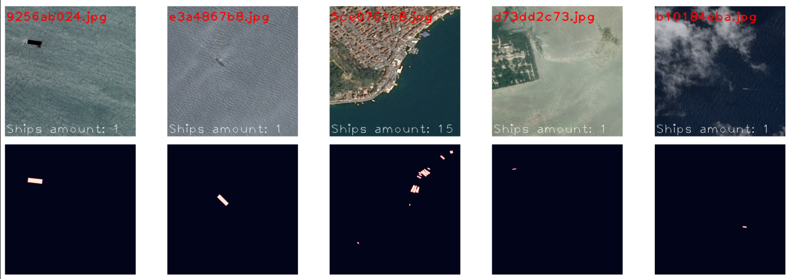
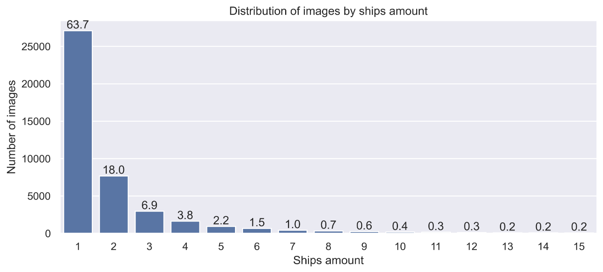
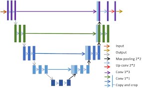
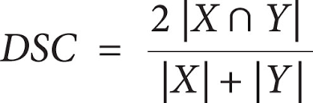

# Airbus Ship Detection

This project is part of the Kaggle competition - ["Airbus Ship Detection"](https://www.kaggle.com/competitions/airbus-ship-detection)

The goal of the competition is to build a computer vision model that can detect ships in satellite images and return an image mask, as shown in the example below.



I took a lot of inspiration from the Kaggle works by [meaninglesslives](https://www.kaggle.com/code/meaninglesslives/airbus-ship-detection-data-visualization), [Boohdaaaan](https://www.kaggle.com/code/boohdaaaan/airbus-ship-detection-u-net) and [IAFOSS](https://www.kaggle.com/code/iafoss/unet34-dice-0-87)

## Project Technology Stack

Python: TensorFlow & Keras, OpenCV, Scikit-learn, NumPy, Pandas, Matplotlib, Seaborn

The model uses a standard **U-NET** architecture, with **Cross-entropy** as the loss function and **Dice score** as the accuracy metric.

## Project structure

- [EDA.ipynb](visualisations/EDA.ipynb): Exploratory Data Analysis of the dataset
- [model_train.py](./model_train.py): Script for training the model
- [inference.py](inference/inference.py): Model inference script that creates masks based on input images
- [model_predictions_visualization.ipynb](visualisations/model_predictions_visualization.ipynb): Testing the model's performance with visualization of generated masks

The model can be downloaded from Google Drive - [unet_model.h5](https://drive.google.com/file/d/1f9Mi1IvinyMAT06aXypBDbCZT7rmJ3fZ/view?usp=sharing)

## Dataset

The dataset contains about 193,000 satellite images sized 768x768 in .jpg format. Many images do not contain ships, while some contain clusters of ships. The images also include challenging visibility conditions such as fog or clouds.

## EDA

During the EDA, I investigated three main questions: class balance in the dataset, characteristics of image appearances and their masks, and the impact of image size on quality.

### Analysis Plan:

1. Ratio of images without ships to images with ships
2. Distribution of images by number of ships
3. Visualization of images without ships, with ships, and their corresponding masks
4. Distribution of images by size
5. Class imbalance within images
6. Visualization of small-sized images

The competition rules stated that many images do not contain ships, but didn't specify an exact number. During the analysis, I found that only 22% (43,000) of the images contain ships. Leaving this imbalance in the training dataset could potentially cause the model to learn to ignore ships and achieve high accuracy by recognizing "empty" images.

Images containing ships also varied in the number of ships present. I plotted the distribution of images by the number of ships they contain:



The distribution has a long tail to the right. More than half of the images contain only one ship. This could become a problem, as the model might learn to recognize only 1-2 ships.

The imbalance within images is also important. We have only two classes: background and ships. The pixel ratio is crucial when choosing a loss function.

I found that in most cases, only 0.02% of pixels (or 1:3500 pixels) belong to the ship class, which represents a significant imbalance.

> If one tries to recall what is the loss function that should be used for strongly unbalanced data set, it is [Focal loss](https://arxiv.org/abs/1708.02002v2), which revolutionized one stage object localization method in 2017. This loss function demonstrates amazing results on datasets with unbalance level 1:10-1000. - [IAFOSS](https://www.kaggle.com/code/iafoss/unet34-dice-0-87)

Small-sized images are often damaged or carry little information. After checking several sets of images, I concluded that this statement is also true for this dataset. Images smaller than 50KB make up only 1% of the total dataset. Their loss will not lead to a significant reduction in training data volume, but may improve overall data quality.

During the EDA, I reached the following conclusions:

1. One mask corresponds to one ship, and each mask is a unique record in the dataset.
2. There is a significant class imbalance (1 to 5) between images with ships and images without ships.
3. The distribution of ship counts in images where they are present is heavily skewed to the right, with more than half of the cases containing only one ship.
4. Some images have labeling errors, which may affect model evaluation.
5. Within the images themselves, there is a significant class imbalance, with more than 99% of pixels being background.
6. Images of 50kb or less make up 1% of the entire dataset, and some of these are damaged.

I've omitted some details that can be viewed in the [EDA.ipynb](visualisations/EDA.ipynb) file.

## Model Training

For the model, I used a standard U-NET architecture, without loading pre-trained weights or modifications like EfficietNet or MobileNet.



My point of interest was to train a simple U-NET model from scratch. Thus, I wanted to focus my attention on understanding the U-NET architecture and the challenges associated with it. Although I was significantly limited in the number of epochs due to limited internet access caused by regular power outages.

### Splitting into Training and Test Datasets

I removed images smaller than 50kb from the dataset. I set the test dataset size to 20%, although it might be worth experimeting with smaller values due to the large volume of data.

An important challenge was to correctly set the number of images without ships. Too many or too few would lead to incorrect model evaluation. I didn't have the opportunity to test many options, so I intuitively settled on a size of 10% of the number of images with ships.

```
all_masks_df = data.copy()

    empty_masks_df = all_masks_df[all_masks_df['ShipsAmount'] == 0]
    ship_masks_df = all_masks_df[all_masks_df['ShipsAmount'] > 0]

    empty_masks_amount = int(ship_masks_df.shape[0] * empty_masks_percent)
    print(f'Number of empty masks  - {empty_masks_amount}')

    all_masks_df = pd.concat([ship_masks_df, empty_masks_df.sample(n=empty_masks_amount, random_state=seed)], axis=0)
```

### Data Generation

In the data generator, we process 48 images at time, read the images, normalize them, and decode their masks.

The choice of a batch of 48 images was based on empirical studies of different options within one training epoch.

The data generator transforms images to a resolution of (256, 256). Working with smaller resolutions is much less computationally expensive and may allow the model to generalize better by focusing on high-level features of ships.

### Model Training Regulation

The model training is regulated by callbacks.

```
def create_callbacks():
    reduce_lr = ReduceLROnPlateau(
        monitor='val_loss',
        factor=0.33,
        patience=1,
        verbose=1,
        mode='min',
        min_delta=0.0001,
        cooldown=0,
        min_lr=1e-8
    )
    early_stopping = EarlyStopping(
        monitor="val_loss",
        mode="min",
        verbose=1,
        patience=10
    )
    return [reduce_lr, early_stopping]
```

ReduceLROnPlateau reduces the learning rate if there are steps without a decrease in the loss function during epoch validation.

EarlyStopping prematurely stops training if there were more than 10 steps without a decrease in the loss function during epoch validation

### Model Accuracy Evaluation Metric

The Dice Coefficient was used as the metric/ The Dice Coefficient measures the overlap between the predicted and true masks, providing a good balance between precision and recall.


Program implementation:

```
def dice_coefficient(y_true, y_pred, smooth=1e-5):
    y_true = tf.cast(y_true, tf.float32)
    y_pred = tf.cast(y_pred, tf.float32)

    if y_true.shape.ndims == 3:
        y_true = tf.expand_dims(y_true, axis=-1)
    if y_pred.shape.ndims == 3:
        y_pred = tf.expand_dims(y_pred, axis=-1)

    intersection = tf.reduce_sum(tf.abs(y_true * y_pred), axis=[1,2,3])
    union = tf.reduce_sum(tf.square(y_true), axis=[1,2,3]) + tf.reduce_sum(tf.square(y_pred), axis=[1,2,3])
    return (2. * intersection + smooth) / (union + smooth)
```

### Optimizer and Loss Function

I used ADAM as the optimizer and Binary Cross-entropy as the loss function. The choice of this loss function is due to its computational simplicity compared to Focal Loss.

I chose the ADAM optimizer due to its adaptive learning rate, which often leads to faster convergence and better performance in practice compared to traditional stochastic gradient descent.

```
def compile_model(model, learning_rate=0.001):
    optimizer = Adam(learning_rate=learning_rate)
    model.compile(
        optimizer=optimizer,
        loss=binary_crossentropy,
        metrics=[dice_coefficient]
    )
    return model
```

### Training Results

After 10 epochs, we managed to achieve a dice coefficient of 55%.
Results of testing the model's predictions:


We can see that the model recognizes medium-sized ships fairly well but has problems with small and large ships. Further analysis also showed that the model poorly recognizes ships in conditions of impaired visibility (fog and clouds).

I've omitted some details that can be viewed in the [model_train.ipynb](model_train.ipynb) file.

## Next Steps

There's still a lot of room for model improvement:

1. Use a pre-trained model and fine-tune it on this dataset
2. Increase the resolution of images that the model accepts
3. Experiment with the number of empty images and the proportion of training images
4. Apply Focal Loss as the loss function
5. Perform data augmentation during data generation, for example, cropping and changing contrast

The problem with all these methods is that they significantly increase the time for model training, which is unfortunately unacceptable for me in conditions of limited power supply.

## Inference

To deploy and test the model, you need to download the files [unet_model.h5](https://drive.google.com/file/d/1f9Mi1IvinyMAT06aXypBDbCZT7rmJ3fZ/view?usp=sharing) and [inference.py](inference.py).

Place the model and inference script in a directory that contains an "Input" directory, from which the script will process images.

The script will create an "Output" folder that will contain the masks created by the model for the processed images.

To set up the Python environment and run the inference:

1. Create a new virtual environment:

```
python -m venv airbus_ship_env
```

2. Activate the environment:

- For Windows

```
airbus_ship_env\Scripts\activate
```

- On MacOs and Linux:

```
source airbus_ship_env/bin/activate
```

3. Install the required packages:

```
pip install -r requirements.txt
```

4. Run the inference script (Pre-change the directory to the one where the inference script is located.):

```
python inference.py
```

The file [requirements.txt](/inference/requirements.txt) can be found in the [inference](/inference/) folder
